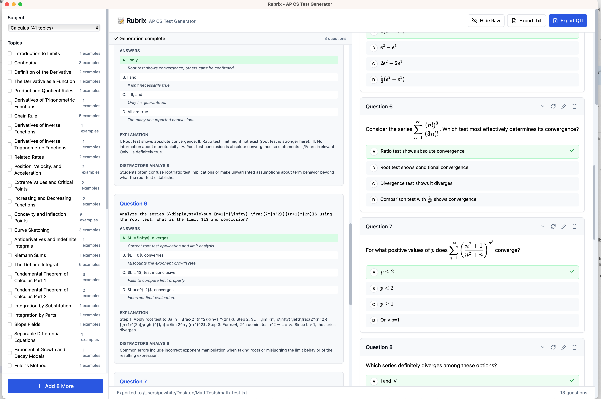

# Rubrix - AI Test Generator

An AI-powered multiple choice question generator for AP Computer Science A and Calculus, built with Tauri + React.



## Features

- 📚 **Multi-Subject Support** - AP Computer Science A and Calculus
- 🎯 **Topic Selection** - Choose from multiple topics per subject
- 🎚️ **Difficulty Control** - Easy, Medium, or Hard questions
- 🤖 **AI Generation** - Powered by Claude Sonnet 4.5 via Replicate with subject-specific prompts
- 🔢 **LaTeX Rendering** - Full mathematical notation support with KaTeX
- ✏️ **Edit Questions** - Modify generated questions before export
- 🔄 **Smart Regeneration** - Regenerate questions with context awareness (preserves subject/topics)
- 📤 **Export to QTI** - Direct export to Schoology-compatible format with enhanced formatting
- 💻 **Code Block Support** - Syntax highlighting for code in questions and answers
- 📊 **Markdown Tables** - Support for tables in question content

## Prerequisites

- [Node.js](https://nodejs.org/) 18+
- [Rust](https://rustup.rs/) 1.70+
- [Tauri CLI](https://tauri.app/v1/guides/getting-started/prerequisites)

## Quick Start

```bash
# Install dependencies
npm install

# Run in development mode
npm run tauri dev

# Build for production
npm run tauri build
```

## Project Structure

```
rubrix/
├── src/                    # React frontend
│   ├── components/         # UI components
│   │   ├── QuestionCard.tsx    # Question display with LaTeX/code rendering
│   │   ├── EditModal.tsx       # Question editor
│   │   ├── Sidebar.tsx         # Topic selection
│   │   └── StreamingPreview.tsx # Real-time generation view
│   ├── App.tsx             # Main app component
│   └── types.ts            # TypeScript types
│
├── src-tauri/              # Rust backend
│   ├── src/
│   │   ├── main.rs         # Tauri commands & Question struct
│   │   ├── llm.rs          # Replicate API client
│   │   ├── qti.rs          # QTI export with LaTeX & formatting
│   │   ├── knowledge.rs    # Subject-specific knowledge management
│   │   └── prompts.rs      # Prompt templating system
│   └── knowledge/          # Subject knowledge bases
│       ├── Computer Science/
│       │   ├── prompt.txt          # CS-specific generation prompt
│       │   ├── question-bank.json  # Example CS questions
│       │   ├── question-schema.json
│       │   └── [topic files].txt   # Topic knowledge
│       └── Calculus/
│           ├── prompt.txt          # Calculus-specific prompt
│           ├── question-bank.json  # Example calc questions
│           └── question-schema.json
│
└── package.json
```

## Configuration

### API Key

Edit `src-tauri/src/llm.rs` and replace:
```rust
const REPLICATE_API_TOKEN: &str = "YOUR_REPLICATE_API_TOKEN_HERE";
```

With your actual Replicate API token.

### Subject-Specific Prompts

Each subject has its own prompt template in `knowledge/[Subject]/prompt.txt`. These prompts use placeholders:
- `{topics}` - Selected topics
- `{difficulty}` - Question difficulty
- `{count}` - Number of questions
- `{examples}` - Few-shot examples from question-bank.json
- `{user_instructions}` - Optional user guidance
- `{regenerate}` - Context for regeneration

### Adding Knowledge Base Questions

Add example questions to `knowledge/[Subject]/question-bank.json`:

```json
{
  "id": "1",
  "text": "What is the derivative of $f(x) = x^2$?",
  "subject": "Calculus",
  "topics": ["Derivatives"],
  "answers": [
    {"text": "$f'(x) = 2x$", "is_correct": true, "explanation": "Power rule"},
    {"text": "$f'(x) = x$", "is_correct": false}
  ],
  "explanation": "Use the power rule"
}
```

**Formatting Support:**
- Inline LaTeX: `$f'(x)$`
- Display LaTeX: `$$\\int_0^1 x^2 dx$$`
- Code blocks: ` ```java ... ``` `
- Inline code: `` `variable` ``
- Markdown tables

Available **Computer Science** topics:
- Arrays, Recursion, Strings, Classes, Inheritance
- ArrayList, 2D Arrays, Sorting

Available **Calculus** topics:
- Derivatives, Integrals, Limits, and more (41 topics total)

## Usage

1. **Select Subject** - Choose between Computer Science or Calculus
2. **Select Topics** - Check the topics you want questions about
3. **Set Difficulty** - Choose Easy, Medium, or Hard
4. **Adjust Count** - Slide to set number of questions (1-20)
5. **Add Notes** - Optional guidance for the AI
6. **Generate** - Click to create questions with streaming preview
7. **Review & Edit** - Modify any questions as needed
8. **Regenerate Individual Questions** - Click regenerate on any question to get a replacement (preserves subject/topics)
9. **Export** - Save as .txt or .imscc (QTI format)

## Exporting to Schoology

1. Click "Export QTI"
2. Save as `questions.imscc`
3. In Schoology: Resources → Add Resources → Import File
4. Select your .imscc file
5. Questions appear as a Question Bank

## Development

### Frontend (React)
```bash
cd rubrix
npm run dev
```

### Backend (Rust)
```bash
cd rubrix/src-tauri
cargo build
```

### Full App
```bash
npm run tauri dev
```

## Tech Stack

- **Frontend**: React 18, TypeScript, Tailwind CSS, Radix UI
- **Rendering**: ReactMarkdown, KaTeX, rehype/remark plugins
- **Backend**: Rust, Tauri
- **AI**: Claude Sonnet 4.5 via Replicate
- **Export**: IMS QTI 1.2 with enhanced LaTeX and formatting support

## Recent Improvements (v0.3.0)

- ✅ Multi-subject support with subject-specific prompts
- ✅ LaTeX rendering with proper prime/apostrophe handling
- ✅ Smart paragraph grouping (inline LaTeX stays in paragraph)
- ✅ HTML escaping only on non-LaTeX text
- ✅ Markdown table support in QTI export
- ✅ Multi-line answer support with `<br />` tags
- ✅ Special character cleaning (UTF-8 artifacts, curly quotes)
- ✅ Question regeneration with context preservation
- ✅ Automatic version syncing between package.json and tauri.conf.json

## License

MIT
