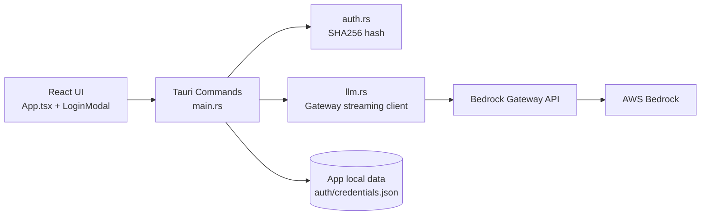
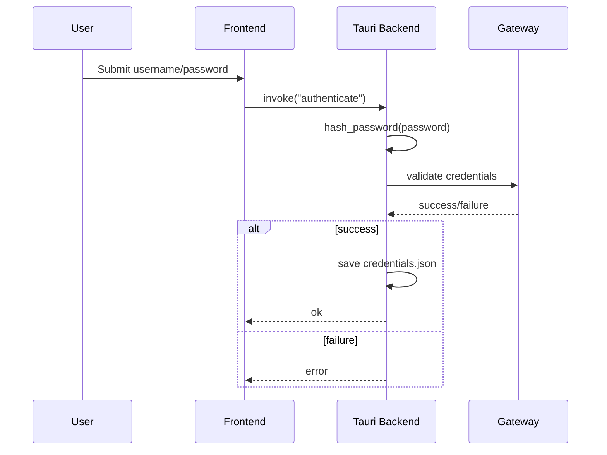
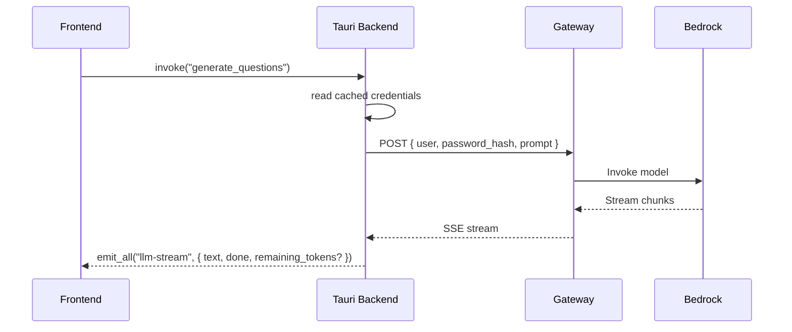

# Architecture Diagram

## Gateway-Only Runtime

## Authentication Sequence

## Generation Sequence

## Startup Behavior

1. Frontend calls `auto_authenticate`.
2. Backend loads saved credentials (if present).
3. Backend re-validates credentials against gateway.
4. App enters authenticated state only on successful validation.

## Configuration

- `BEDROCK_GATEWAY_URL` is required for runtime auth and generation.
- If missing, backend returns: "Gateway mode is required, but BEDROCK_GATEWAY_URL is not configured."

## Notes

- Direct Bedrock token modes are removed from active runtime flow.
- Gateway JSON error payloads are treated as errors even when transport status is `200` in stream mode.
- Streaming event payload remains stable as `{ text, done, remaining_tokens? }`.
